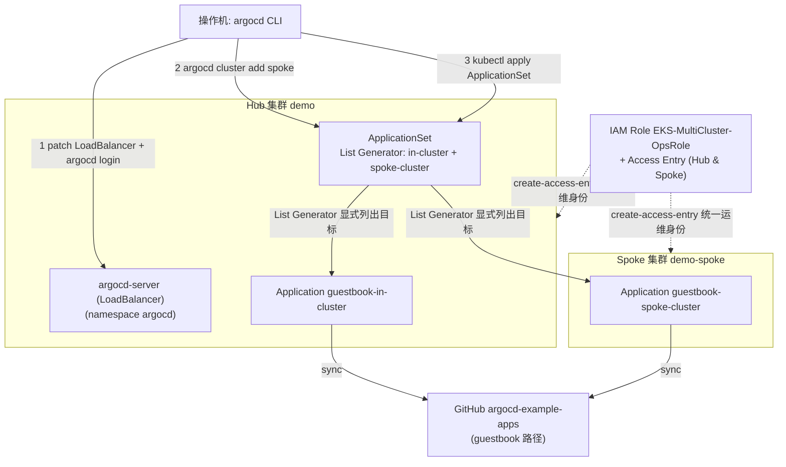
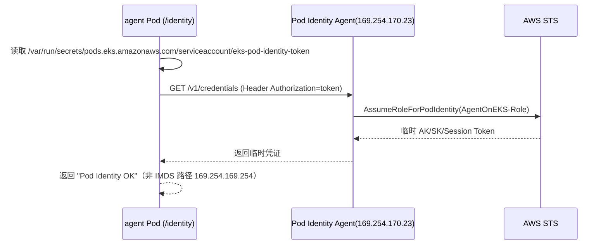
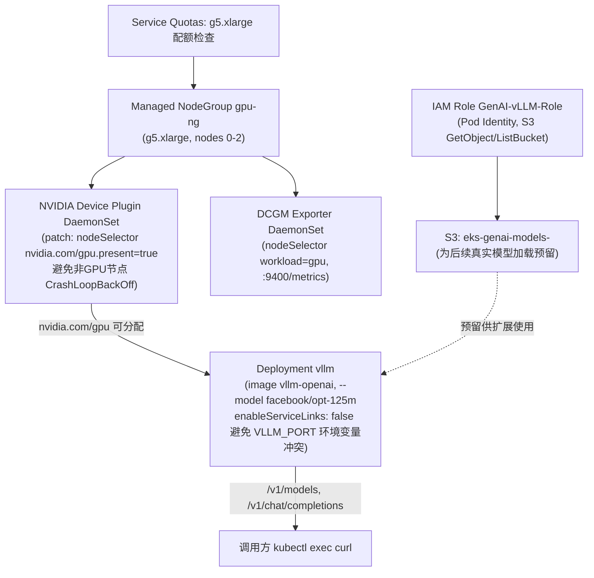
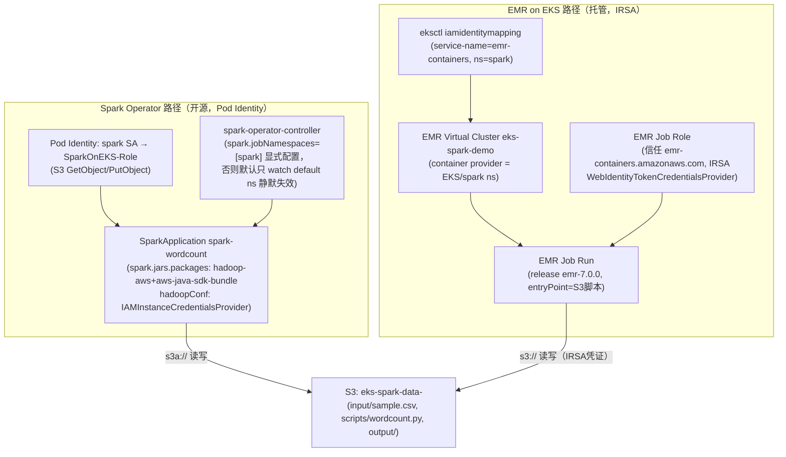
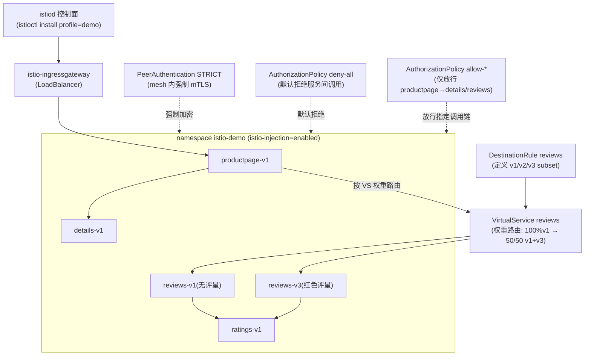

# 架构文档

本仓库包含 12 个 Lab（`docs/lab01-*.md` ~ `docs/lab12-*.md`），这里不做全量架构图汇总，只对其中组件交互较复杂、值得可视化的 Lab 提供架构图；其余 Lab 请直接看对应的 `docs/labNN-*.md`。

选中的 6 个 Lab：

- **Lab02** — 多集群管理（ArgoCD Hub-Spoke）：跨 2 个 EKS 集群的 GitOps 分发，涉及 Hub/Spoke 集群、ApplicationSet 控制器、跨集群 IAM 身份
- **Lab04** — AI Agent on EKS：EKS Pod 通过 Pod Identity 免密调用 Bedrock/DynamoDB/Secrets Manager 的凭证链路，本仓库特有（中国区版本无此 Lab，因 Bedrock 在中国区不可用）
- **Lab05** — GenAI GPU 推理（vLLM）：Managed GPU NodeGroup + 手动 NVIDIA Device Plugin + Pod Identity + DCGM 监控的完整链路
- **Lab06** — Spark on EKS：Spark Operator（Pod Identity + hadoop-aws 手动接入 S3A）与 EMR on EKS（IRSA + service-linked role）两条凭证机制完全不同的数据处理路径并行
- **Lab08** — CodePipeline 进行 EKS CI/CD：CodeCommit → CodePipeline → CodeBuild → ECR → EKS 的跨 AWS 服务交付链路，且 CodeBuild/CodePipeline 使用两个职责分离的服务角色
- **Lab12** — Istio 服务网格：控制面安装、Bookinfo 金丝雀发布、mTLS 强制加密、AuthorizationPolicy 服务间授权的完整闭环

其余 Lab（Lab01 Auto Mode、Lab03 Kubecost、Lab07 Gateway API+LBC、Lab09 OpenSearch+Fluent Bit、Lab10 集群升级、Lab11 Kyverno）以单一组件/单一操作链路为主，不再单独画图。

---

## Lab02 — 多集群管理（ArgoCD Hub-Spoke）

Hub 集群 `demo` 部署 ArgoCD Server（LoadBalancer 暴露）；新建的 Spoke 集群 `demo-spoke` 注册进 ArgoCD。ApplicationSet 用 List Generator 显式列出 `in-cluster` 和 `spoke-cluster` 两个目标，为每个集群生成一个 guestbook Application，验证同一份 Git 仓库能同时分发到两个物理集群。另外创建一个跨集群统一的 IAM 运维角色，通过 EKS Access Entry 同时授权 Hub 和 Spoke 两个集群的管理权限。



## Lab04 — AI Agent on EKS

演示 EKS Pod 通过 **Pod Identity**（而非传统 IMDS）免密获取 AWS 临时凭证，用来调用 Bedrock、DynamoDB、Secrets Manager。实验用一个最小 HTTP 服务验证凭证链路本身：Pod 读取挂载的 identity token 文件，携带它请求 Pod Identity Agent 的本地凭证端点换取 STS 临时凭证。IAM Role 上已经配置好 `bedrock:InvokeModel`、`dynamodb:*Item`（限定 `agent-sessions` 表）、`secretsmanager:GetSecretValue`（限定 `agent-webhook-*`）三组权限，供后续真实业务逻辑调用；示例代码本身只验证凭证链路可用，不代表业务已实际调用这三个服务。

```mermaid
flowchart TB
  subgraph EKS["EKS 集群 demo, namespace agent-demo"]
    SA["ServiceAccount agent-sa"]
    Deploy["Deployment agent (2 副本)\n/health /identity 探测端点"]
    Svc["Service agent (ClusterIP)"]
  end
  PIA["EKS Pod Identity Agent\n169.254.170.23/v1/credentials"]
  IAMRole["IAM Role AgentOnEKS-Role\n(bedrock:InvokeModel*, dynamodb:*Item on agent-sessions,\nsecretsmanager:GetSecretValue on agent-webhook-*)"]
  Bedrock["Amazon Bedrock\n(amazon.nova-lite-v1:0)"]
  DDB["DynamoDB 表 agent-sessions\n(PAY_PER_REQUEST)"]
  Secrets["Secrets Manager\nagent-webhook-demo"]

  SA -->|create-pod-identity-association| IAMRole
  Deploy -->|serviceAccountName| SA
  Deploy -->|1 读取token文件 2 GET凭证| PIA
  PIA -->|AssumeRoleForPodIdentity| IAMRole
  IAMRole -.->|已授权(供业务逻辑调用)| Bedrock
  IAMRole -.->|已授权(供业务逻辑调用)| DDB
  IAMRole -.->|已授权(供业务逻辑调用)| Secrets
  Svc --> Deploy
```

Pod Identity 凭证获取的实际调用时序（区别于传统 IMDS 的关键点）：



## Lab05 — GenAI GPU 推理（vLLM）

先申请 GPU 配额后创建 Managed GPU NodeGroup（g5.xlarge），再手动安装 NVIDIA Device Plugin——官方 static manifest 不带 `nodeSelector`，会被调度到全部节点，需额外 patch 限定到 GPU 节点，否则非 GPU 节点上的 Pod 会 CrashLoopBackOff 导致 `rollout status` 卡住超时。vLLM 直接从 HuggingFace 拉取小模型（`facebook/opt-125m`）启动推理服务；S3 模型桶 + Pod Identity 已配置好供后续接入真实模型下载使用。DCGM Exporter 以 Prometheus 格式暴露 GPU 利用率指标。



---

## Lab06 — Spark on EKS

两条数据处理路径使用**完全不同的凭证机制**访问 S3。Spark Operator 走 **Pod Identity**，需在 `hadoopConf` 指定 `IAMInstanceCredentialsProvider`；EMR on EKS 走 **IRSA**，需要 `WebIdentityTokenCredentialsProvider`，且集群需先用 `eksctl create iamidentitymapping --service-name emr-containers` 授权。官方 `spark-py` 镜像不含 `hadoop-aws`/`aws-java-sdk-bundle`，两条路径都需额外指定 jar 版本。



---

## Lab08 — CodePipeline 进行 EKS CI/CD

CodeCommit 仓库触发 CodePipeline，CodeBuild 用 `buildspec.yml` 构建镜像、推送 ECR，并在 `post_build` 阶段直接 `kubectl apply` 完成部署。关键点：CodeBuild 的服务角色（`EKS-CodeBuild-Role`，需要 ECR 推送权限 + EKS Access Entry 授权）和 CodePipeline 的服务角色（`EKS-CodePipeline-Role`，需要 S3/CodeCommit/CodeBuild 权限）是两个独立角色——CodePipeline 不能复用 CodeBuild 的角色，因为该角色的信任策略只允许 `codebuild.amazonaws.com` 扮演。

```mermaid
flowchart LR
  Op["操作机: git push\n(CodeCommit credential-helper)"]
  CC["CodeCommit 仓库 cicd-demo"]
  CP["CodePipeline cicd-demo-pipeline\n(Source → Build)"]
  S3A["S3 Artifact Bucket\ncicd-demo-artifacts"]
  CB["CodeBuild Project cicd-demo-build\n(buildspec: docker build/push + kubectl apply)"]
  ECR["ECR cicd-demo"]
  EKS["EKS 集群 demo\nDeployment cicd-demo (2副本)"]
  CBRole["IAM Role EKS-CodeBuild-Role\n(ECR PowerUser + eks:DescribeCluster + S3)\n+ EKS Access Entry ClusterAdminPolicy"]
  CPRole["IAM Role EKS-CodePipeline-Role\n(S3 + CodeCommit + CodeBuild，独立于CodeBuild角色)"]

  Op -->|git push main| CC
  CC -->|Source Action| CP
  CP -->|assume| CPRole
  CP -->|SourceOutput| S3A
  CP -->|Build Action| CB
  CB -->|assume| CBRole
  CB -->|docker build/push| ECR
  CB -->|kubectl apply(替换 IMAGE_PLACEHOLDER)| EKS
  CBRole -.->|EKS Access Entry 授权| EKS
```

---

## Lab12 — Istio 服务网格

在独立 `istio-demo` namespace 部署 Istio 控制面与 Bookinfo 示例应用，验证服务网格三大核心能力：**流量管理**（VirtualService 权重路由做金丝雀发布，从 100% v1 逐步切到 50/50 v1+v3）、**mTLS**（`PeerAuthentication STRICT` 强制服务间加密）、**服务间授权**（`AuthorizationPolicy` 先 deny-all 再逐个放行 productpage→details/reviews 的调用链）。EKS 1.35 支持 Kubernetes Native Sidecar，`istio-proxy` 注入到 `initContainers` 而非 `containers`，验证 sidecar 注入时需要同时检查两处。


