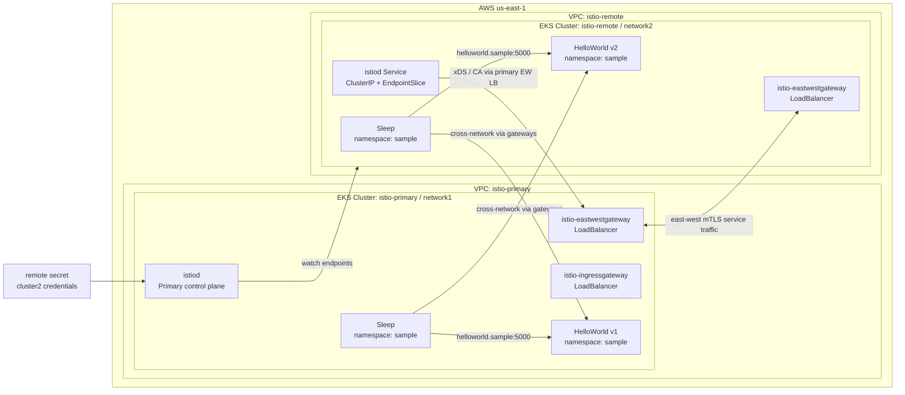
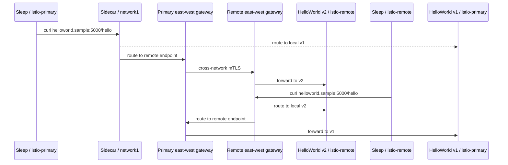

# 架构文档

## 目标

复测 Istio primary-remote 多集群模式，验证两个独立 EKS 集群之间可以通过 Istio 进行跨集群服务发现和流量转发。

## 拓扑

- `istio-primary`
  - AWS Region：`us-east-1`
  - Istio network：`network1`
  - 角色：主集群，运行 Istio control plane
  - 样例服务：HelloWorld v1、Sleep
- `istio-remote`
  - AWS Region：`us-east-1`
  - Istio network：`network2`
  - 角色：从集群，使用主集群 Istio control plane
  - 样例服务：HelloWorld v2、Sleep

两个集群使用独立 VPC。每个集群默认创建一个 managed node group，包含 2 台 `m5.large` 节点。

## 架构图



## 流量路径

验证时，两个集群中都会部署 Sleep Pod。Sleep 访问：

```text
helloworld.sample:5000/hello
```

预期流量会在两个版本之间负载均衡：

- v1：运行在 `istio-primary`
- v2：运行在 `istio-remote`

如果从任意一个集群发起请求都能看到 v1/v2 混合返回，则说明跨集群服务发现和 east-west 流量路径正常。

## 请求路径图



## Istio 组件

`istio-primary` 中包含：

- `istiod`
- `istio-ingressgateway`
- `istio-eastwestgateway`
- remote secret：允许主集群读取 `istio-remote` 的 endpoint

`istio-remote` 中包含：

- remote profile 生成的基础资源
- `istio-eastwestgateway`
- 指向主集群 east-west gateway 的 `istiod` service 映射

## EKS FQDN 特殊处理

Istio remote profile 默认会在 remote 集群里创建 `ExternalName` service，让 remote webhook 指向主集群 east-west gateway 的 ELB FQDN。在 EKS 上，这条路径会遇到 Kubernetes admission webhook 限制，常见错误包括：

```text
unsupported service type "ExternalName"
```

或：

```text
Address is not allowed
```

本仓库脚本做了以下处理：

- 将 remote `istiod` 改为 `ClusterIP`
- 创建 `EndpointSlice` 指向主集群 east-west gateway 当前解析出的 IP
- 将 remote sidecar injector webhook 的 `failurePolicy` 调整为 `Ignore`
- remote east-west gateway 使用已注入后的 Deployment patch
- remote 样例 workload 使用 `istioctl kube-inject` 手工注入

这部分逻辑集中在：

- `scripts/02-install-istio.sh`
- `scripts/03-verify.sh`
- `configs/remote-eastwestgateway-patch.yaml`
